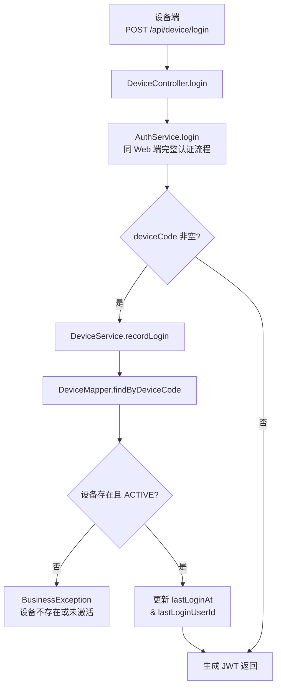
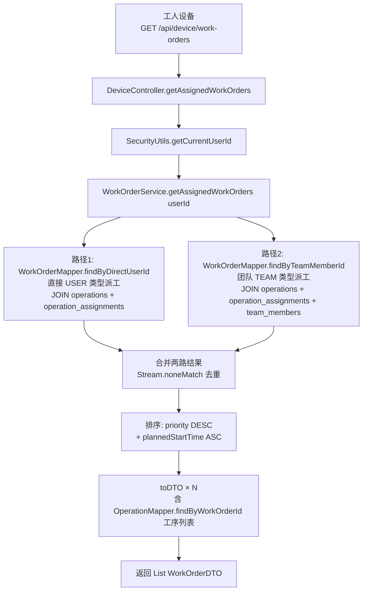
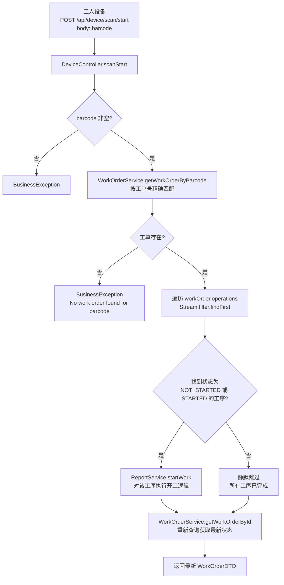
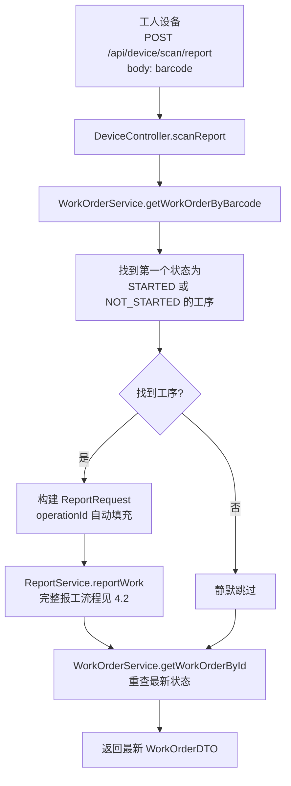
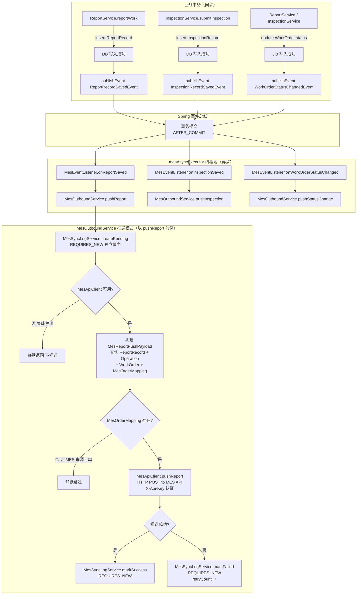
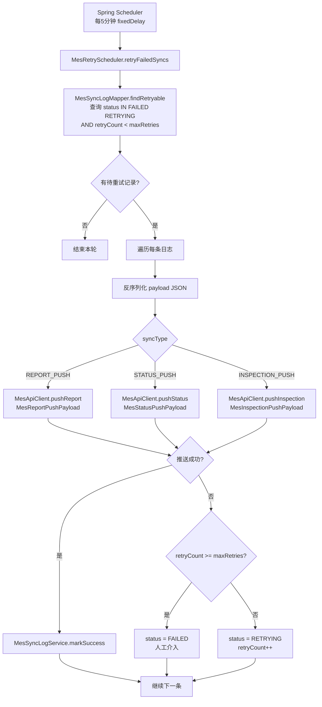
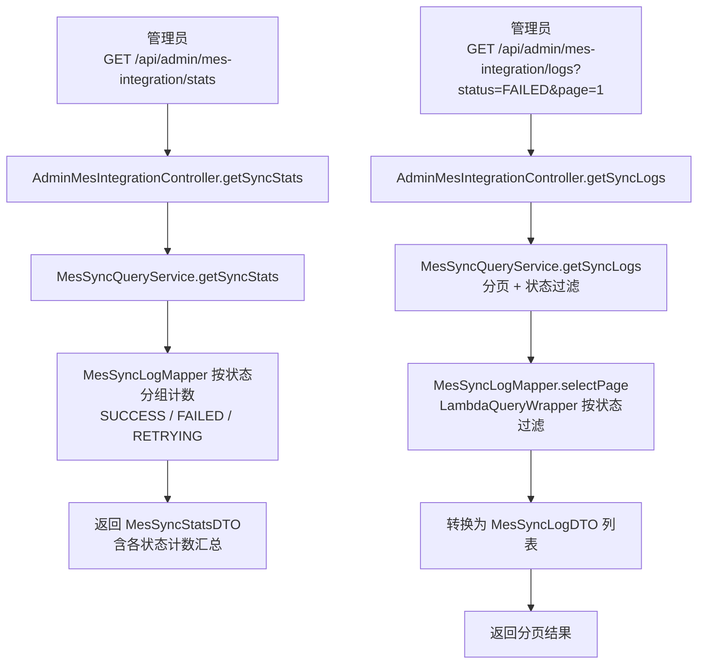
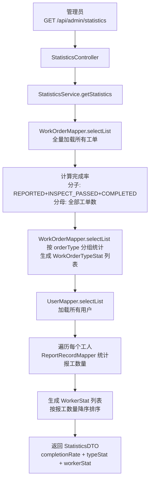

# EasyWork 工单系统 — 调用流程文档

## 目录

1. [系统架构总览](#1-系统架构总览)
2. [用户认证流程](#2-用户认证流程)
3. [工单管理流程（管理端）](#3-工单管理流程管理端)
4. [设备端生产作业流程](#4-设备端生产作业流程)
5. [质检流程](#5-质检流程)
6. [安灯呼叫流程](#6-安灯呼叫流程)
7. [MES 集成流程](#7-mes-集成流程)
8. [统计查询流程](#8-统计查询流程)
9. [模块间数据流总览](#9-模块间数据流总览)

---

## 1. 系统架构总览

```mermaid
flowchart TD
    subgraph Client["客户端"]
        WEB[Web 管理端\nAdmin Browser]
        DEV[工业手持设备\nAndroid/PDA]
        MES_SYS[MES 系统\n上游 ERP/MES]
    end

    subgraph Gateway["Spring Security 网关层"]
        JWT[JWT 鉴权过滤器\nJwtAuthenticationFilter]
    end

    subgraph API["业务 API 层"]
        AUTH[AuthController\n/api/auth]
        ADMIN_WO[AdminWorkOrderController\n/api/admin/work-orders]
        ADMIN_TEAM[AdminTeamController\n/api/admin/teams]
        ADMIN_USER[AdminUserController\n/api/admin/users]
        ADMIN_INSP[InspectionController\n/api/admin/inspections]
        ADMIN_MES[AdminMesIntegrationController\n/api/admin/mes-integration]
        DEVICE[DeviceController\n/api/device]
        WEBHOOK[MesWebhookController\n/api/mes]
    end

    subgraph Services["业务服务层"]
        AUTH_SVC[AuthService]
        WO_SVC[WorkOrderService]
        REPORT_SVC[ReportService]
        INSP_SVC[InspectionService]
        CALL_SVC[CallService]
        TEAM_SVC[TeamService]
        USER_SVC[UserService]
        MES_IN[MesInboundService]
        MES_OUT[MesOutboundService]
        STATS_SVC[StatisticsService]
    end

    subgraph Events["Spring 事件总线"]
        EVT[ApplicationEventPublisher]
        LISTENER[MesEventListener\n@TransactionalEventListener\n@Async]
    end

    subgraph DB["数据库"]
        MYSQL[(MySQL)]
    end

    subgraph External["外部系统"]
        MES_API[MES REST API]
    end

    WEB -->|HTTPS + JWT| JWT
    DEV -->|HTTPS + JWT| JWT
    MES_SYS -->|HTTPS| JWT
    JWT --> API
    API --> Services
    Services --> EVT
    EVT --> LISTENER
    LISTENER --> MES_OUT
    MES_OUT -->|HTTP POST| MES_API
    Services --> DB
```

---

## 2. 用户认证流程

### 2.1 Web/管理端登录

```mermaid
flowchart TD
    A[客户端\nPOST /api/auth/login] --> B{@Valid 参数校验}
    B -->|校验失败| B1[返回 400\nMethodArgumentNotValidException]
    B -->|校验通过| C[AuthController.login]
    C --> D[AuthService.login]
    D --> E[AuthenticationManager.authenticate\nUsernamePasswordAuthenticationToken]
    E --> F[UserDetailsServiceImpl.loadUserByUsername\n工号查询用户]
    F --> G[UserMapper.findByEmployeeNumber]
    G --> H{用户是否存在}
    H -->|不存在| H1[抛出 UsernameNotFoundException]
    H1 --> H2[AuthService 捕获\n抛出 BusinessException 401]
    H -->|存在| I[BCrypt 密码比对]
    I -->|密码错误| I1[抛出 AuthenticationException\n→ BusinessException 401]
    I -->|密码正确| J[UserMapper.findByEmployeeNumber\n再次查询获取 User 实体]
    J --> K{账号状态 == ACTIVE?}
    K -->|否| K1[抛出 BusinessException 403\n账号已禁用]
    K -->|是| L{deviceCode 非空?}
    L -->|是| M[DeviceService.recordLogin\n校验设备 + 记录登录信息]
    M --> N[JwtTokenProvider.generateToken\n生成 JWT]
    L -->|否| N
    N --> O[构建 LoginResponse\ntoken + employeeNumber + realName + role + userId]
    O --> P[返回 200\nApiResponse包装]
```

### 2.2 设备端登录（与 Web 端共用 AuthService）



---

## 3. 工单管理流程（管理端）

### 3.1 创建工单（含工序）

```mermaid
flowchart TD
    A[管理员\nPOST /api/admin/work-orders] --> B[AdminWorkOrderController.createWorkOrder]
    B --> C[SecurityUtils.getCurrentUserId\n获取当前登录用户 ID]
    C --> D[WorkOrderService.createWorkOrder\n@Transactional]
    D --> E[WorkOrderMapper.findByOrderNumber\n校验工单号唯一性]
    E --> F{工单号已存在?}
    F -->|是| F1[BusinessException\nOrder number already exists]
    F -->|否| G[WorkOrderMapper.insert\n插入工单主记录\n状态: NOT_STARTED]
    G --> H{operations 列表非空?}
    H -->|是| I[循环 AtomicInteger 序号生成\n{orderNumber}-OP001, OP002...]
    I --> J[OperationMapper.insert × N\n批量插入工序\n状态: NOT_STARTED\n完成数量: 0]
    H -->|否| K[toDTO 转换]
    J --> K
    K --> L[OperationMapper.findByWorkOrderId\n查询工序列表填充 DTO]
    L --> M[返回 WorkOrderDTO\n含完整工序列表]
```

### 3.2 工序派工

```mermaid
flowchart TD
    A[管理员\nPOST /api/admin/work-orders/assign] --> B[AdminWorkOrderController.assignWorkOrder]
    B --> C[WorkOrderService.assignWorkOrder\n@Transactional]
    C --> D[OperationMapper.selectById\n校验工序存在性]
    D --> E{工序存在?}
    E -->|否| E1[BusinessException\nOperation not found]
    E -->|是| F{assignmentType}
    F -->|USER| G[遍历 userIds\n构建 OperationAssignment\nassignmentType=USER]
    F -->|TEAM| H[遍历 teamIds\n构建 OperationAssignment\nassignmentType=TEAM]
    G --> I[OperationAssignmentMapper.insert × N\n批量写入派工记录]
    H --> I
    I --> J[返回 Assignment successful]
```

### 3.3 工单查询（工人视角 — 双路径合并）



---

## 4. 设备端生产作业流程

### 4.1 手动开工

```mermaid
flowchart TD
    A[工人设备\nPOST /api/device/start\nbody: operationId] --> B[DeviceController.startWork]
    B --> C{operationId 非空?}
    C -->|否| C1[BusinessException\nOperation ID required]
    C -->|是| D[ReportService.startWork\n@Transactional]
    D --> E[OperationMapper.selectById\n查询工序]
    E --> F{工序存在?}
    F -->|否| F1[BusinessException\nOperation not found]
    F -->|是| G{status == NOT_STARTED?}
    G -->|否| G1[BusinessException\n工序状态不允许开工]
    G -->|是| H[operation.status = STARTED\nOperationMapper.updateById]
    H --> I[updateWorkOrderStatusOnStart\n检查工单是否首次开工]
    I --> J{workOrder.status == NOT_STARTED?}
    J -->|是| K[workOrder.status = STARTED\n记录 actualStartTime\nWorkOrderMapper.updateById]
    K --> L[publishEvent WorkOrderStatusChangedEvent]
    J -->|否| M[返回 Operation started]
    L --> M
```

### 4.2 手动报工

```mermaid
flowchart TD
    A[工人设备\nPOST /api/device/report\nReportRequest] --> B[DeviceController.reportWork]
    B --> C[SecurityUtils.getCurrentUserId]
    C --> D[ReportService.reportWork\n@Transactional]

    D --> E[OperationMapper.selectById\n查询工序]
    E --> F{工序存在且状态合法?}
    F -->|否| F1[BusinessException]
    F -->|是| G[ReportRecordMapper.sumReportedQuantityByOperationId\n计算已报数量 sumQty]

    G --> H{reportedQuantity == null?}
    H -->|是| I[自动填充: plannedQty - sumQty]
    H -->|否| J{数量 > 0 且 <= 剩余量?}
    J -->|否| J1[BusinessException\n数量不合法]
    I --> K
    J -->|是| K[设置 qualifiedQty 默认 = reportedQty\ndefectQty 默认 = 0]
    K --> L[ReportRecordMapper.insert\n持久化报工记录]
    L --> M[publishEvent ReportRecordSavedEvent\n异步推送 MES]
    M --> N[更新工序完成数量\ncompletedQty += reportedQty]
    N --> O{completedQty >= plannedQty?}
    O -->|是| P[operation.status = REPORTED\nOperationMapper.updateById]
    O -->|否| Q[operation.status = STARTED\nOperationMapper.updateById]
    P --> R[updateWorkOrderOnReport\n检查工单整体完成情况]
    Q --> R
    R --> S[汇总所有工序完成数量\nWorkOrderMapper.updateById]
    S --> T{所有工序均达终态\n且 orderType == PRODUCTION?}
    T -->|是| U[workOrder.status = REPORTED\nWorkOrderMapper.updateById]
    U --> V[publishEvent WorkOrderStatusChangedEvent\n异步推送 MES]
    T -->|否| W[返回 ReportRecord]
    V --> W
```

### 4.3 扫码开工（一码操作）



### 4.4 扫码报工



### 4.5 撤销报工

```mermaid
flowchart TD
    A[工人设备\nPOST /api/device/report/undo\nUndoReportRequest] --> B[DeviceController.undoReport]
    B --> C[SecurityUtils.getCurrentUserId]
    C --> D[ReportService.undoReport\n@Transactional]
    D --> E[OperationMapper.selectById]
    E --> F[ReportRecordMapper.findLatestByOperationIdAndUser\n查最新未撤销记录]
    F --> G{记录存在?}
    G -->|否| G1[BusinessException\n无可撤销记录]
    G -->|是| H[record.isUndone = true\nrecord.undoTime = now\nReportRecordMapper.updateById\n软撤销]
    H --> I[ReportRecordMapper.sumReportedQuantityByOperationId\n重新聚合有效完成数量]
    I --> J{newCompleted == 0?}
    J -->|是| K[operation.status = NOT_STARTED]
    J -->|否| L[operation.status = STARTED]
    K --> M[OperationMapper.updateById]
    L --> M
    M --> N[updateWorkOrderOnReport\n重算工单完成数量]
    N --> O[返回 Report undone]
```

---

## 5. 质检流程

```mermaid
flowchart TD
    A[质检员\nPOST /api/admin/inspections\nInspectionRequest] --> B[InspectionController.submitInspection]
    B --> C[SecurityUtils.getCurrentUserId\n获取质检员 ID]
    C --> D[InspectionService.submitInspection\n@Transactional]

    D --> E[WorkOrderMapper.selectById\n查询工单]
    E --> F{工单存在?}
    F -->|否| F1[BusinessException\nWork order not found]
    F -->|是| G{workOrder.status == REPORTED?}
    G -->|否| G1[BusinessException\nWork order must be in REPORTED status]
    G -->|是| H[构建 InspectionRecord\ninspectionType = QUALITY\nstatus = INSPECTED\ninspectionTime = now]

    H --> I[InspectionRecordMapper.insert\n持久化质检记录]
    I --> J[publishEvent InspectionRecordSavedEvent\n异步推送 MES 质检数据]
    J --> K{inspectionResult == PASSED?}
    K -->|是| L[workOrder.status = INSPECT_PASSED]
    K -->|否| M[workOrder.status = INSPECT_FAILED]
    L --> N[WorkOrderMapper.updateById]
    M --> N
    N --> O[publishEvent WorkOrderStatusChangedEvent\n异步推送 MES 状态变更]
    O --> P[返回 InspectionRecord]
```

---

## 6. 安灯呼叫流程

### 6.1 发起呼叫（ANDON / INSPECTION / TRANSPORT）

```mermaid
flowchart TD
    A[工人设备] --> B{呼叫类型}
    B -->|POST /api/device/call/andon| C1[callType = ANDON]
    B -->|POST /api/device/call/inspection| C2[callType = INSPECTION]
    B -->|POST /api/device/call/transport| C3[callType = TRANSPORT]

    C1 --> D[DeviceController.buildCallRequest\n从 Map body 提取 workOrderId/operationId/description]
    C2 --> D
    C3 --> D
    D --> E{workOrderId 非空?}
    E -->|否| E1[BusinessException]
    E -->|是| F[CallService.createCall\n@Transactional]

    F --> G[WorkOrderMapper.selectById\n校验工单存在]
    G --> H{工单存在?}
    H -->|否| H1[BusinessException\nWork order not found]
    H -->|是| I[构建 CallRecord\nstatus = NOT_HANDLED\ncallTime = now]
    I --> J[CallRecordMapper.insert\n持久化呼叫记录]
    J --> K[返回 CallRecord]
```

### 6.2 处理人认领呼叫

```mermaid
flowchart TD
    A[处理人员\ncallId + handlerId] --> B[CallService.handleCall\n@Transactional]
    B --> C[CallRecordMapper.selectById]
    C --> D{记录存在?}
    D -->|否| D1[BusinessException\nCall record not found]
    D -->|是| E{status == NOT_HANDLED?}
    E -->|否| E1[BusinessException\nCall is already being handled or completed]
    E -->|是| F[record.status = HANDLING\nrecord.handlerId = handlerId\nrecord.handleTime = now\nCallRecordMapper.updateById]
    F --> G[返回 CallRecord]
```

### 6.3 完成处理

```mermaid
flowchart TD
    A[处理人员\ncallId + handlerId + handleResult] --> B[CallService.completeCall\n@Transactional]
    B --> C[CallRecordMapper.selectById]
    C --> D{记录存在?}
    D -->|否| D1[BusinessException\nCall record not found]
    D -->|是| E[record.status = HANDLED\nrecord.handlerId = handlerId\nrecord.handleResult = handleResult\nrecord.completeTime = now\nCallRecordMapper.updateById]
    E --> F[返回 CallRecord]
```

---

## 7. MES 集成流程

### 7.1 入站：MES 推送工单（Webhook）

```mermaid
flowchart TD
    A[MES 系统\nPOST /api/mes/work-orders/import\nX-Api-Key + JWT] --> B[MesWebhookController.importWorkOrder]
    B --> C[MesInboundService.importWorkOrder\n@Transactional]
    C --> D[MesOrderMappingMapper.findByMesOrderId\n幂等检查]
    D --> E{已存在映射?}
    E -->|是| F[返回现有 localWorkOrderId\nduplicated = true]
    E -->|否| G[WorkOrderMapper.insert\n创建本地工单\nstatus = NOT_STARTED]
    G --> H[循环工序列表\n{orderNumber}-OP001, OP002...\nOperationMapper.insert × N]
    H --> I{有人员分配?}
    I -->|assignedEmployeeNumbers| J[UserMapper.findByEmployeeNumber × N\n查找用户 ID\nOperationAssignmentMapper.insert × N\nassignmentType = USER]
    I -->|assignedTeamCodes| K[TeamMapper.findByTeamCode × N\n查找团队 ID\nOperationAssignmentMapper.insert × N\nassignmentType = TEAM]
    I -->|无| L
    J --> L[MesOrderMappingMapper.insert\n建立 mesOrderId <-> localWorkOrderId 映射]
    K --> L
    L --> M[返回 MesImportResponse\nlocalWorkOrderId + duplicated = false]
```

### 7.2 出站：事件驱动推送链路



### 7.3 出站：定时重试链路



### 7.4 管理端 MES 监控查询



---

## 8. 统计查询流程



---

## 9. 模块间数据流总览

```mermaid
flowchart LR
    subgraph AdminSide["管理端操作"]
        ADMIN_CREATE[创建工单\n+工序]
        ADMIN_ASSIGN[派工\nUSER/TEAM]
        ADMIN_INSP[质检提交]
    end

    subgraph DeviceSide["设备端操作"]
        DEV_LOGIN[设备登录]
        DEV_QUERY[查询工单]
        DEV_START[开工]
        DEV_REPORT[报工/扫码]
        DEV_CALL[安灯呼叫]
    end

    subgraph CoreModules["核心业务模块"]
        WO[workorder\n工单+工序]
        OP[operation\n工序状态]
        REPORT[report\n报工记录]
        INSP[inspection\n质检记录]
        CALL[call\n呼叫记录]
        DEVICE_MOD[device\n设备信息]
        AUTH[auth\nJWT认证]
        USER[user\n用户]
        TEAM[team\n班组]
    end

    subgraph MESLayer["MES 集成层"]
        EVENTS[Spring Events\n事件总线]
        MES_LISTENER[MesEventListener\nAFTER_COMMIT+Async]
        MES_OUTBOUND[MesOutboundService\n出站推送]
        MES_INBOUND[MesInboundService\n入站导入]
        MES_LOG[MesSyncLogService\nREQUIRES_NEW日志]
        MES_RETRY[MesRetryScheduler\n每5分钟重试]
        MES_CLIENT[MesApiClient\nHTTP Client]
    end

    subgraph ExternalMES["外部 MES 系统"]
        MES_EXT[(MES REST API)]
    end

    DEV_LOGIN --> AUTH --> DEVICE_MOD
    ADMIN_CREATE --> WO --> OP
    ADMIN_ASSIGN --> OP
    DEV_QUERY --> WO
    DEV_QUERY --> OP
    DEV_START --> REPORT --> OP --> WO
    DEV_REPORT --> REPORT --> OP --> WO
    DEV_REPORT --> EVENTS
    ADMIN_INSP --> INSP --> WO
    ADMIN_INSP --> EVENTS
    DEV_CALL --> CALL --> WO
    WO --> EVENTS

    EVENTS --> MES_LISTENER --> MES_OUTBOUND
    MES_OUTBOUND --> MES_LOG
    MES_OUTBOUND --> MES_CLIENT --> MES_EXT
    MES_RETRY --> MES_CLIENT

    MES_EXT -->|Webhook| MES_INBOUND --> WO
    MES_INBOUND --> OP

    WO --> USER
    WO --> TEAM
    OP --> USER
    OP --> TEAM
```

---

## 附录：工单/工序状态流转

### 工单状态机

```mermaid
stateDiagram-v2
    [*] --> NOT_STARTED : 创建工单
    NOT_STARTED --> STARTED : 任一工序首次开工\nReportService.startWork
    STARTED --> REPORTED : 所有工序完成报工\nReportService.updateWorkOrderOnReport
    REPORTED --> INSPECT_PASSED : 质检通过\nInspectionService.submitInspection
    REPORTED --> INSPECT_FAILED : 质检不通过\nInspectionService.submitInspection
    INSPECT_PASSED --> COMPLETED : 管理员确认完成
    INSPECT_FAILED --> REPORTED : 返工重新报工
```

### 工序状态机

```mermaid
stateDiagram-v2
    [*] --> NOT_STARTED : 工单创建时初始化
    NOT_STARTED --> STARTED : ReportService.startWork
    STARTED --> REPORTED : 报工数量达到计划量\nReportService.reportWork
    REPORTED --> STARTED : 撤销报工后\n有效数量 > 0\nReportService.undoReport
    STARTED --> NOT_STARTED : 撤销报工后\n有效数量 = 0\nReportService.undoReport
    REPORTED --> INSPECTED : 质检完成（可选）
    REPORTED --> TRANSPORTED : 转运完成（可选）
    REPORTED --> HANDLED : 系统处理（可选）
```

### 呼叫状态机

```mermaid
stateDiagram-v2
    [*] --> NOT_HANDLED : CallService.createCall
    NOT_HANDLED --> HANDLING : CallService.handleCall
    HANDLING --> HANDLED : CallService.completeCall
    NOT_HANDLED --> HANDLED : CallService.completeCall\n允许跳过认领直接完成
```
